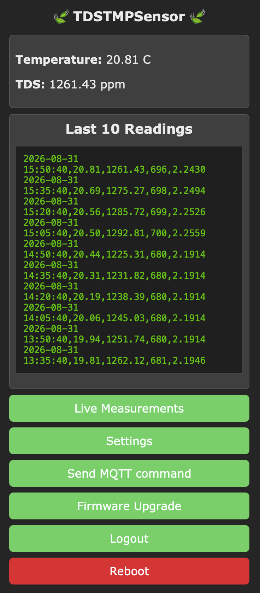
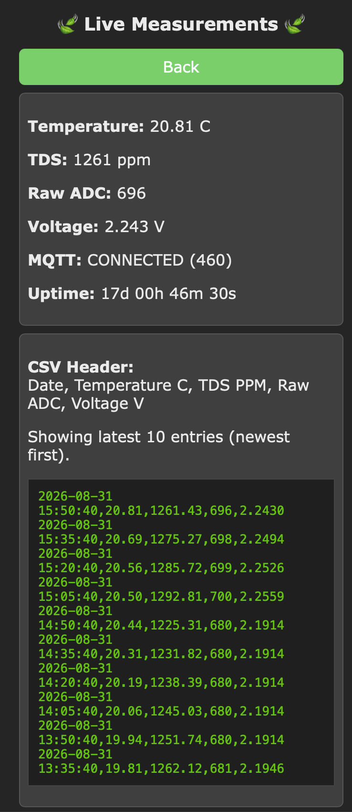
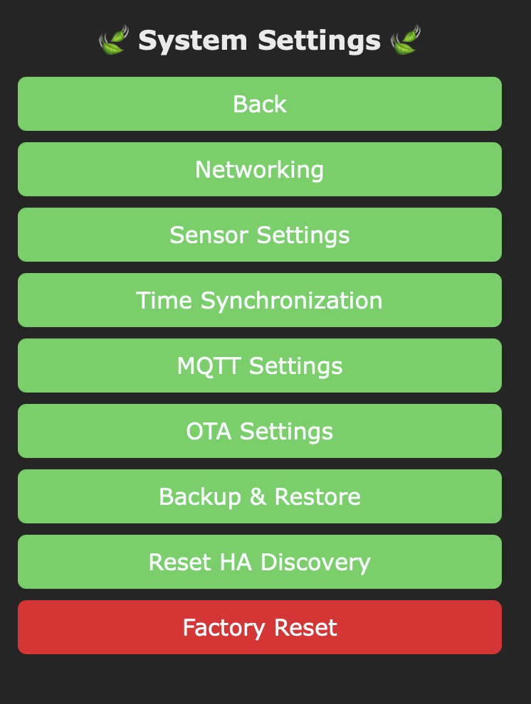
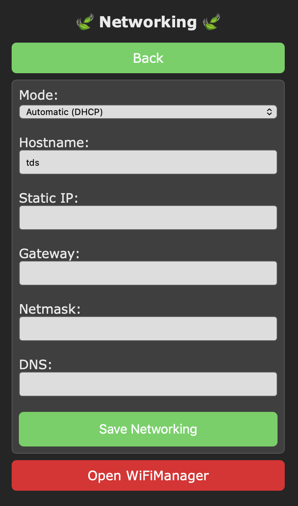
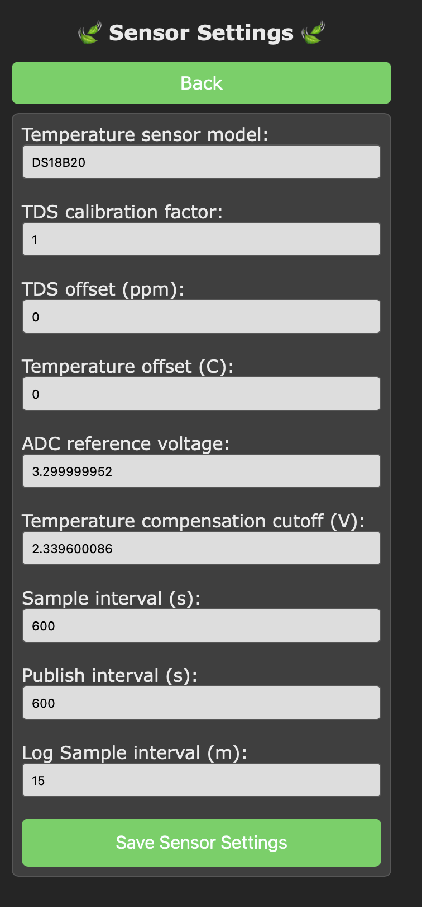
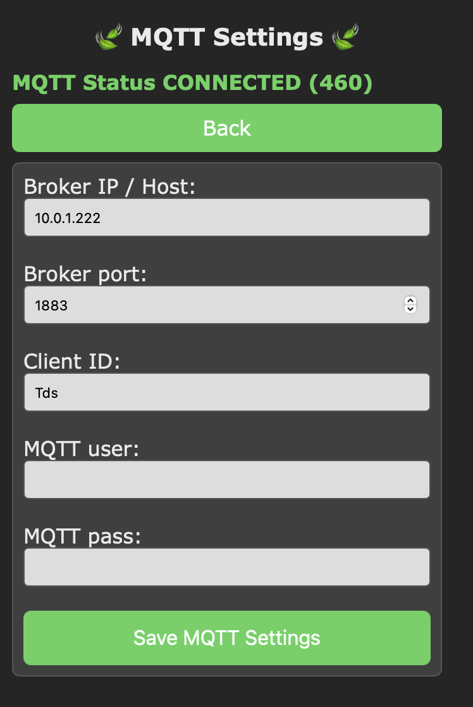
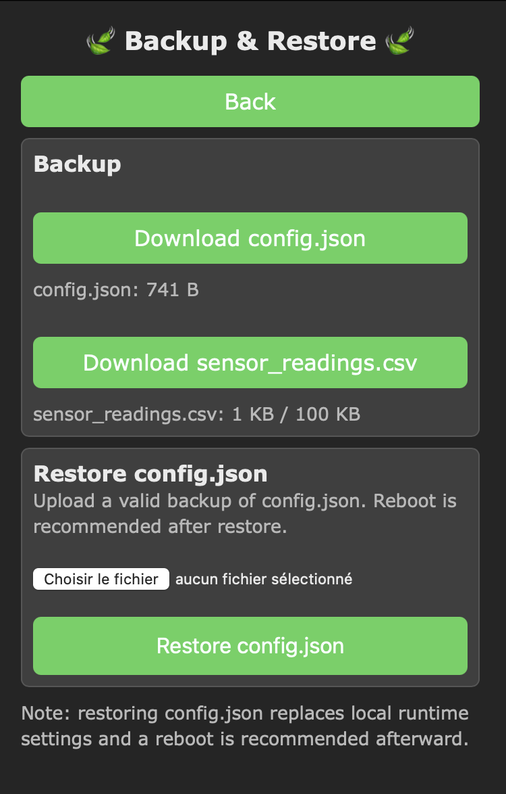
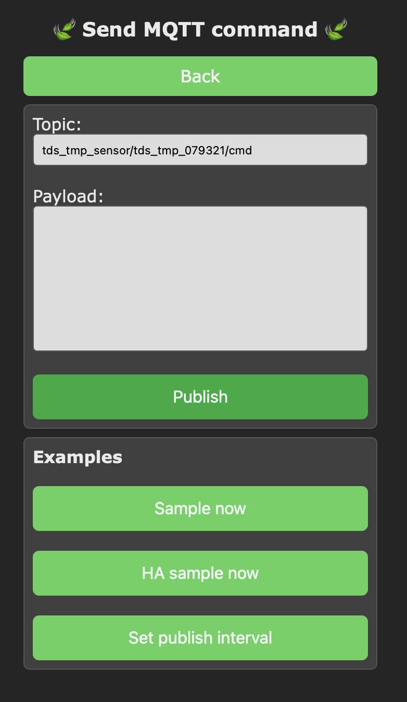

  <h1>TDS Sensor</h1>
  
<strong>ESP8266 TDS and temperature sensor for Home Assistant</strong>

  

    <a href="#build-with-platformio">Build</a> |
    <a href="#wiring">Wiring</a> |
    <a href="#enclosure-and-assembly">Enclosure</a> |
    <a href="#first-setup">First setup</a>
  

  
  
  

<h2 id="table-of-contents">Table of Contents</h2>

<ul>
  <li><a href="#overview">Overview</a></li>
  <li><a href="#features">Features</a></li>
  <li><a href="#hardware">Hardware</a></li>
  <li><a href="#device-naming">Device naming</a></li>
  <li><a href="#component-reference">Component reference</a></li>
  <li><a href="#soldering">Soldering the power and controller connections</a></li>
  <li><a href="#buck-converter-5v-jumper">Buck converter 5 V jumper</a></li>
  <li><a href="#crimping-and-wire-preparation">Crimping connectors and preparing wires</a></li>
  <li><a href="#wiring">Wiring</a></li>
  <li><a href="#bill-of-materials">Bill of materials</a></li>
  <li><a href="#enclosure-and-assembly">Enclosure and assembly</a></li>
  <li><a href="#build-with-platformio">Build with PlatformIO</a></li>
  <li><a href="#upload-firmware">Upload firmware</a></li>
  <li><a href="#ota-upgrade">OTA upgrade and LittleFS data</a></li>
  <li><a href="#initial-wi-fi-configuration">Initial Wi-Fi configuration</a></li>
  <li><a href="#default-web-ui-login">Default Web UI login</a></li>
  <li><a href="#first-setup">First setup</a></li>
  <li><a href="#web-ui-reference">Web UI reference</a></li>
  <li><a href="#home-assistant-interface">Home Assistant interface</a></li>
  <li><a href="#security">Security</a></li>
  <li><a href="#repository-layout">Repository layout</a></li>
  <li><a href="#license">License</a></li>
</ul>

<h2 id="overview">Overview</h2>

  This project measures total dissolved solids (TDS) and water temperature with an ESP8266 controller. It reads a DFRobot SEN0244 analog TDS sensor, applies temperature compensation using a DS18B20 probe, and publishes readings through MQTT for Home Assistant.

  <strong>TDS range limitation:</strong> the DFRobot SEN0244 has a specified measurement range of <strong>0 to 1000 ppm</strong>. A calculated value above 1000 ppm is outside the sensor's validated recognition range and should not be treated as an accurate measurement; the sensor cannot reliably distinguish higher concentrations. The firmware may still display values above 1000 ppm because its analog calculation is not hard-clamped, but changing the calibration factor does not extend the physical sensor range. See the <a href="https://wiki.dfrobot.com/sen0244/">DFRobot SEN0244 specifications</a> for the manufacturer's range and accuracy information.

<h2 id="features">Features</h2>

<ul>
  <li>TDS measurement in ppm through an analog input</li>
  <li>DS18B20 temperature measurement and temperature compensation</li>
  <li>WiFiManager onboarding</li>
  <li>MQTT state publishing and Home Assistant MQTT discovery</li>
  <li>Browser-based configuration and sensor calibration</li>
  <li>OTA firmware updates</li>
  <li>LittleFS configuration and sensor log storage</li>
  <li>Factory reset input on the controller board</li>
</ul>

<h2 id="hardware">Hardware</h2>

<ul>
  <li>Wemos D1 Mini (ESP8266)</li>
  <li>DFRobot SEN0244 analog TDS sensor</li>
  <li>DFRobot DS18B20 temperature probe</li>
  <li>5 V supply for the controller board</li>
  <li>Optional 12 V supply and 12-24 V to 5 V buck converter</li>
</ul>

<h2 id="device-naming">Device naming</h2>

  When no custom name is saved, the firmware generates the device name using this format:
  <code>tds-tmp-sensor-XXXXXX</code>

<ul>
  <li>Prefix: <code>tds-tmp-sensor-</code></li>
  <li>Suffix: six uppercase hexadecimal characters</li>
  <li>Identifier source: the ESP8266 value returned by <code>ESP.getChipId()</code>, masked to 24 bits</li>
</ul>

Example: <code>tds-tmp-sensor-ABC123</code>.

  The code does not take the last four characters of the Wi-Fi MAC address. The helper function is named <code>applyDefaultIdentityFromMac()</code>, but its current implementation uses <code>ESP.getChipId()</code> to create a six-character suffix.

  A custom name can be saved from the network settings page. When set, that name replaces the generated default and is used as the Wi-Fi hostname, the mDNS hostname (<code>http://&lt;device-name&gt;.local</code>), the WiFiManager portal name, and the Home Assistant MQTT discovery device identifier.

<h2 id="component-reference">Component reference</h2>

The following reference photos identify the main electronic, wiring, power, and assembly tools used by this project.

<table>
  <tr>
    <td align="center"> <em>Wemos D1 Mini</em></td>
    <td align="center"> <em>DFRobot SEN0244 TDS sensor</em></td>
    <td align="center"> <em>DFRobot DS18B20</em></td>
  </tr>
  <tr>
    <td align="center"> <em>12-24 V to 5 V buck converter</em></td>
    <td align="center"> <em>JST-XH connector kit</em></td>
    <td align="center"> <em>JST connector crimping tool</em></td>
  </tr>
</table>

<h2 id="soldering">Soldering the power and controller connections</h2>

  Disconnect the 12 V supply and USB cable before soldering. Work from the labels printed on each board and verify every connection with a multimeter before applying power.

<table>
  <tr>
    <td align="center"> <em>Buck converter</em></td>
    <td align="center"> <em>Wemos D1 Mini</em></td>
  </tr>
</table>

<ol>
  <li>Identify the buck-converter input and output pads. Connect the 12 V supply to <code>IN+</code> and <code>IN-</code>, observing polarity.</li>
  <li>Connect the regulated output to the controller power wiring: <code>OUT+</code> to the Wemos <code>5V</code> pin and <code>OUT-</code> to <code>GND</code>.</li>
  <li>Before connecting the Wemos, power the buck converter from the supply and adjust or verify its output at approximately 5.0 V DC.</li>
  <li>Solder short, clearly identified leads or connector wires to the Wemos pins required by the installation: <code>5V</code>, <code>GND</code>, <code>A0</code>, <code>D2</code> / <code>GPIO4</code>, and the optional <code>D5</code> / <code>GPIO14</code> factory-reset input.</li>
  <li>Use heat-shrink tubing on exposed solder joints and add strain relief so the connector cannot pull directly on a pad.</li>
  <li>Check continuity, polarity, and the absence of shorts between <code>5V</code> and <code>GND</code> before connecting the Wemos and sensors.</li>
</ol>

<strong>Important:</strong> never connect the 12 V supply directly to the Wemos <code>5V</code> pin. The Wemos and connected sensors must receive the regulated output from the buck converter.

<h3 id="buck-converter-5v-jumper">Set the buck converter to 5 V</h3>

  This buck-converter board uses solder-selectable output pads on its back. The Wemos and the sensors in this project require a regulated 5 V output, so bridge only the two pads marked <code>5V</code> before connecting the controller.

  

<ol>
  <li>Disconnect the 12 V supply and USB cable from the project.</li>
  <li>Turn the converter over and locate the output-selection row and the <code>5V</code> marking shown in the reference image.</li>
  <li>Use a small amount of flux and solder to bridge the two pads for the <code>5V</code> selection.</li>
  <li>Check that the solder bridge does not touch the neighboring voltage-selection pads. Remove any unintended bridge before powering the board.</li>
  <li>Power the converter from the 12 V supply and measure between <code>VOUT+</code> and <code>GND</code>. Confirm approximately 5.0 V DC before connecting the Wemos.</li>
</ol>

<strong>Important:</strong> the jumper selects the converter output voltage; it does not replace the voltage measurement. Do not connect the Wemos until the measured output is correct.

<h2 id="crimping-and-wire-preparation">Crimping connectors and preparing wires</h2>

  This section refers to the JST-XH/XH2.54 connectors listed in the BOM. Use the correct contact size and housing for the prewired connector kit; do not force a terminal into a mismatched housing.

  
  

<ol>
  <li>Install the buck converter, Wemos, terminal blocks, and sensor electronics in their final positions on the mounting plate before measuring wires.</li>
  <li>Route each wire along its final path and measure from connector to connector. Keep runs as short as practical, but leave enough slack to unplug a connector and remove the plate without stressing the wires.</li>
  <li>Cut and label one wire at a time. Keep power, ground, analog signal, and one-wire data conductors identifiable at both ends.</li>
  <li>Strip only the length required by the contact manufacturer, typically about 2-3 mm for small JST-XH contacts. Do not nick or remove conductor strands.</li>
  <li>Place the stripped conductor in the contact so the conductor wings crimp onto bare copper and the insulation wings support the cable jacket.</li>
  <li>Crimp with the correct die position, then inspect the joint. The conductor should be held firmly without cutting through the wire or leaving loose strands.</li>
  <li>Perform a gentle pull test on every crimp, then insert the contact into the housing until the locking tang clicks. Confirm the pin order and connector keying before mating it.</li>
  <li>Use a multimeter to verify continuity end-to-end and confirm that adjacent pins are not shorted.</li>
</ol>

<table>
  <thead>
    <tr>
      <th>Connection</th>
      <th>Routing guidance</th>
    </tr>
  </thead>
  <tbody>
    <tr>
      <td>Buck <code>OUT+</code> to Wemos <code>5V</code></td>
      <td>Use the shortest safe power run and verify 5 V before connection.</td>
    </tr>
    <tr>
      <td>Buck <code>OUT-</code> to Wemos <code>GND</code></td>
      <td>Use a short ground run and maintain a common ground for the sensors.</td>
    </tr>
    <tr>
      <td>Wemos <code>A0</code> to SEN0244 analog output</td>
      <td>Keep the analog signal wire short and separated from unnecessary power loops.</td>
    </tr>
    <tr>
      <td>Wemos <code>D2</code> / <code>GPIO4</code> to DS18B20 data</td>
      <td>Route directly to the temperature connector and avoid excess coiled wire.</td>
    </tr>
  </tbody>
</table>

  The goal is a compact harness with no loose loops, while retaining enough service slack for inspection, connector removal, and enclosure maintenance. See <a href="docs/BOM.md#component-images">docs/BOM.md</a> for the component images and parts list.

<h2 id="wiring">Wiring</h2>

<table>
  <thead>
    <tr>
      <th>Controller pin</th>
      <th>Connection</th>
    </tr>
  </thead>
  <tbody>
    <tr>
      <td><code>A0</code></td>
      <td>SEN0244 analog TDS output</td>
    </tr>
    <tr>
      <td><code>D2</code> / <code>GPIO4</code></td>
      <td>DS18B20 one-wire data</td>
    </tr>
    <tr>
      <td><code>D5</code> / <code>GPIO14</code></td>
      <td>Factory reset input, jumper to GND at boot</td>
    </tr>
    <tr>
      <td><code>5V</code> and <code>GND</code></td>
      <td>Sensor and controller power connections as appropriate</td>
    </tr>
  </tbody>
</table>

See <a href="docs/hardware-pinout.md">docs/hardware-pinout.md</a> for board assumptions and electrical notes.

<h2 id="bill-of-materials">Bill of materials</h2>

See the complete parts list, assembly hardware, 3D-printing notes, and enclosure credits in <a href="docs/BOM.md">docs/BOM.md</a>.

<h2 id="enclosure-and-assembly">Enclosure and assembly</h2>

The repository includes the current 3MF files for the enclosure and sensor plate:

<ul>
  <li><a href="Enclosure%20and%20mount/Box.3mf">Box.3mf</a></li>
  <li><a href="Enclosure%20and%20mount/Sensor%20Plate.3mf">Sensor Plate.3mf</a></li>
</ul>

<table>
  <tr>
    <td align="center"> <em>Populated mounting plate</em></td>
    <td align="center"> <em>Plate installed in the enclosure</em></td>
  </tr>
  <tr>
    <td align="center" colspan="2"> <em>Installed enclosure</em></td>
  </tr>
</table>

  The parts list identifies the board holders, capacitor holder, connector holder, cable-tie holder, and standoffs used by the assembly. Confirm dimensions and clearances against your exact components before printing.

<h2 id="build-with-platformio">Build with PlatformIO</h2>

<h3>Requirements</h3>

<ul>
  <li>VS Code with the PlatformIO extension, or PlatformIO CLI</li>
  <li>A Wemos D1 Mini connected by USB</li>
  <li>The dependencies listed in <a href="platformio.ini">platformio.ini</a></li>
</ul>

From the project directory:

<pre><code>pio run</code></pre>

  The build target is <code>WEMOS_D1_Mini</code>. The pre-build script automatically increments the local build number and updates <code>include/fw_version_auto.h</code>.

<h2 id="upload-firmware">Upload firmware</h2>

Replace <code>&lt;PORT&gt;</code> with the serial port assigned to your board:

<pre><code>pio run -t upload --upload-port &lt;PORT&gt;
pio run -t uploadfs --upload-port &lt;PORT&gt;</code></pre>

  The first command uploads the firmware. The second uploads the LittleFS web interface and filesystem data. For the exported release images, see <a href="artifacts/reflash/FLASHING.md">artifacts/reflash/FLASHING.md</a>.

<h2 id="ota-upgrade">OTA upgrade and LittleFS data</h2>

  <strong>Important:</strong> the firmware and LittleFS are separate flash areas. A firmware-only OTA update normally preserves the settings, but uploading a new LittleFS image replaces the filesystem contents. This removes <code>/config.json</code> and <code>/sensor_readings.csv</code>, so all runtime settings stored in <code>config.json</code> are lost unless they are restored from a backup.

<h3>Firmware-only OTA update</h3>

<ol>
  <li>Log in to the device Web UI at <code>http://&lt;device-ip&gt;/login</code> if authentication is enabled.</li>
  <li>From the home page select <strong>Firmware Upgrade</strong>. This opens the OTA page at <code>/update</code>.</li>
  <li>Upload the firmware <code>.bin</code> file only, then wait for the controller to restart. Do not upload a LittleFS image unless the web interface or filesystem contents must also be updated.</li>
  <li>After the restart, open <strong>Settings &gt; MQTT Settings</strong> and confirm that the MQTT connection is restored.</li>
</ol>

<h3>Upgrade that includes LittleFS</h3>

  Use this procedure whenever you upload a LittleFS image, including <code>pio run -t uploadfs</code> or an exported <code>*-littlefs.bin</code> image. The filesystem image contains the web interface, but it also replaces the persistent configuration and sensor log. The saved Wi-Fi credentials managed by WiFiManager may remain outside LittleFS, but the device hostname, MQTT settings, OTA credentials, time zone, sensor calibration, intervals, and other values stored in <code>config.json</code> will not.

<ol>
  <li>
    <strong>Back up before updating:</strong> open <strong>Settings &gt; Backup &amp; Restore</strong> at <code>/settings/backup_restore</code>. Select <strong>Download config.json</strong> and keep the downloaded file outside the project. Select <strong>Download sensor_readings.csv</strong> as well if the measurement history is needed.
  </li>
  <li>
    <strong>Perform the update:</strong> upload the new firmware and LittleFS images using the method described in <a href="#upload-firmware">Upload firmware</a> or <a href="artifacts/reflash/FLASHING.md">the release flashing instructions</a>. Expect the LittleFS upload to erase the previous configuration and sensor log.
  </li>
  <li>
    <strong>Reconnect after the update:</strong> use the device IP address if the previous hostname no longer works. Because the stored OTA credentials were erased, the firmware defaults are used until the backup is restored: username <code>admin</code>, password <code>adminpass</code>. Open <code>http://&lt;device-ip&gt;/login</code>.
  </li>
  <li>
    <strong>Restore the configuration:</strong> open <strong>Settings &gt; Backup &amp; Restore</strong>, choose the saved <code>config.json</code> file, and select <strong>Restore config.json</strong>. Reboot the controller after the restore so the device name, MQTT topic paths, and all loaded settings are applied consistently.
  </li>
  <li>
    <strong>Verify the installation:</strong> check <strong>Settings &gt; Networking</strong>, <strong>Settings &gt; MQTT Settings</strong>, <strong>Settings &gt; OTA Settings</strong>, <strong>Settings &gt; Time Synchronization</strong>, and <strong>Settings &gt; Sensor Settings</strong>. Confirm the device reports <strong>MQTT Status CONNECTED</strong>, then check Home Assistant discovery.
  </li>
</ol>

  If the backup is not restored, the device returns to its default identity and settings. Home Assistant uses the device name when it creates discovery identifiers and entity unique IDs, so it may create a new device while the previous entities remain orphaned. In that case the Home Assistant device and dashboard must be reconfigured. Restoring <code>config.json</code> preserves the previous identity and avoids this unnecessary reconfiguration.

<h2 id="initial-wi-fi-configuration">Initial Wi-Fi configuration</h2>

  This project uses <a href="https://github.com/tzapu/WiFiManager">WiFiManager</a> to configure the wireless network without hard-coding an SSID or password in the firmware. The official WiFiManager project provides the library documentation, examples, and configuration details.

<ol>
  <li>Power the device with no saved Wi-Fi credentials, or clear its previous network configuration.</li>
  <li>Wait for the controller to start its WiFiManager configuration access point. The access-point name is the current device name, for example <code>tds-tmp-sensor-ABC123</code>.</li>
  <li>Connect a phone or computer to that temporary access point. A captive portal should open automatically; if it does not, open the configuration page shown by WiFiManager.</li>
  <li>Select the local Wi-Fi network, enter its password, and save the configuration.</li>
  <li>After the controller restarts or reconnects, return to the normal Wi-Fi network and open the device using its assigned IP address or mDNS name, such as <code>http://tds-tmp-sensor-ABC123.local</code>.</li>
</ol>

  The firmware calls <code>wm.autoConnect(deviceName)</code> during startup. Once credentials are saved, it attempts to reconnect automatically on later boots. For WiFiManager-specific behavior and troubleshooting, see the <a href="https://github.com/tzapu/WiFiManager">official WiFiManager documentation</a>.

<h2 id="default-web-ui-login">Default Web UI login</h2>

  The initial Web UI and OTA credentials are case-sensitive:

<table>
  <tr><th>Username</th><td><code>admin</code></td></tr>
  <tr><th>Password</th><td><code>adminpass</code></td></tr>
</table>

  Open <code>http://&lt;device-ip&gt;/login</code> when Web UI login is required. These are the credentials currently defined by the firmware; <code>Admin</code> and <code>Adminpass</code> with uppercase initials will not work unless the firmware defaults are changed. After signing in, change them at <strong>Settings &gt; OTA Settings</strong>, then select <strong>Save OTA Settings</strong>. The OTA credentials are also used to access the Web UI.

<h2 id="first-setup">First setup</h2>

<ol>
  <li>
    <strong>Upload the firmware and web interface:</strong> from the PlatformIO project, upload the firmware and then upload the LittleFS image. The web pages used below are stored in <code>data/web/</code> and must be present on the controller.
  </li>
  <li>
    <strong>Start the controller:</strong> power-cycle the device and wait for it to finish booting. If Web UI login is enabled, open <code>http://&lt;device-ip&gt;/login</code> and sign in with the OTA user and password.
  </li>
  <li>
    <strong>Configure Wi-Fi when required:</strong> if no Wi-Fi credentials are saved, join the WiFiManager access point first and follow <a href="#initial-wi-fi-configuration">Initial Wi-Fi configuration</a>. After the device joins the network, open <code>http://&lt;device-ip&gt;/</code> or <code>http://&lt;device-name&gt;.local/</code>.
  </li>
  <li>
    <strong>Configure the device settings:</strong> from the home page select <strong>Settings</strong>. Use the following paths and save each page before continuing:
    <ul>
      <li><strong>Settings &gt; Networking:</strong> set the <strong>Hostname</strong> and choose <strong>Automatic (DHCP)</strong> or enter the <strong>Static IP</strong>, <strong>Gateway</strong>, <strong>Netmask</strong>, and <strong>DNS</strong>. Select <strong>Save Networking</strong>. Network mode or IP changes may require a reboot.</li>
      <li><strong>Settings &gt; Sensor Settings:</strong> review the <strong>TDS calibration factor</strong>, <strong>TDS offset (ppm)</strong>, <strong>Temperature offset (C)</strong>, <strong>Temperature compensation cutoff (V)</strong>, <strong>Sample interval (s)</strong>, and <strong>Publish interval (s)</strong>. Select <strong>Save Sensor Settings</strong>.</li>
      <li><strong>Settings &gt; Time Synchronization:</strong> enter the POSIX <strong>Time zone</strong> string, for example <code>EST5EDT,M3.2.0/2,M11.1.0/2</code>, then select <strong>Apply Time Zone</strong>.</li>
      <li><strong>Settings &gt; MQTT Settings:</strong> enter <strong>Broker IP / Host</strong>, <strong>Broker port</strong> (normally <code>1883</code>), <strong>Client ID</strong>, <strong>MQTT user</strong>, and <strong>MQTT pass</strong>. Select <strong>Save MQTT Settings</strong>. The page should then report <strong>MQTT Status CONNECTED</strong>.</li>
      <li><strong>Settings &gt; OTA Settings:</strong> set the <strong>OTA user</strong> and <strong>OTA pass</strong>. Enable <strong>Require Web UI login</strong> when the interface should require authentication, then select <strong>Save OTA Settings</strong>. The same OTA credentials are used for Web UI login.</li>
    </ul>
    

      Direct page paths are <code>/settings/network</code>, <code>/settings/sensors</code>, <code>/settings/time</code>, <code>/settings/mqtt</code>, and <code>/settings/ota</code>. The corresponding save actions are performed by the page buttons; do not browse directly to the save paths.
    

  </li>
  <li>
    <strong>Verify MQTT and Home Assistant:</strong> return to <code>http://&lt;device-ip&gt;/</code>, open <strong>Settings &gt; MQTT Settings</strong>, and confirm <strong>MQTT Status CONNECTED</strong>. Then check Home Assistant for the automatically discovered device and its entities.
  </li>
  <li>
    <strong>Calibrate the sensor:</strong> go to <strong>Settings &gt; Sensor Settings</strong>, set the calibration factor and offset as required by the reference solution, select <strong>Save Sensor Settings</strong>, and confirm the reading in <strong>Live Measurements</strong> or Home Assistant.
  </li>
</ol>

The MQTT topic contract is documented in <a href="docs/mqtt-contract-v1.md">docs/mqtt-contract-v1.md</a>.

<h2 id="web-ui-reference">Web UI reference</h2>

  The following screenshots show the web interface included in the firmware. The paths in the captions are the corresponding device URLs. The displayed measurements, addresses, and configuration values come from one installation and are examples only; replace or redact installation-specific values before publishing if required.

<h3>Home page and measurements</h3>

<table>
  <tr>
    <td align="center"> <em>Home page: <code>/</code></em></td>
    <td align="center"> <em>Live Measurements: <code>/measurements</code></em></td>
  </tr>
</table>

<h3>Settings and configuration</h3>

<table>
  <tr>
    <td align="center"> <em>System Settings: <code>/settings</code></em></td>
    <td align="center"> <em>Networking: <code>/settings/network</code></em></td>
  </tr>
  <tr>
    <td align="center"> <em>Sensor Settings: <code>/settings/sensors</code></em></td>
    <td align="center"> <em>Time Synchronization: <code>/settings/time</code></em></td>
  </tr>
  <tr>
    <td align="center"> <em>MQTT Settings: <code>/settings/mqtt</code></em></td>
    <td align="center"> <em>OTA Settings: <code>/settings/ota</code></em></td>
  </tr>
</table>

<h3>Backup, commands, and reset</h3>

<table>
  <tr>
    <td align="center"> <em>Backup &amp; Restore: <code>/settings/backup_restore</code></em></td>
    <td align="center"> <em>Send MQTT command: <code>/mqtt_send</code></em></td>
  </tr>
  <tr>
    <td align="center" colspan="2"> <em>Reset controls at the bottom of <code>/settings</code></em></td>
  </tr>
</table>

<h3>Reset controls</h3>

  <strong>Reset HA Discovery:</strong> selecting <strong>Settings &gt; Reset HA Discovery</strong> opens <code>/ha_discovery_reset</code> and asks the firmware to republish the current Home Assistant MQTT discovery messages. This is useful when Home Assistant has lost the device entities or needs the current entity definitions published again. It does not erase the device configuration, Wi-Fi credentials, sensor log, or existing Home Assistant entities.

  <strong>Factory Reset:</strong> selecting <strong>Settings &gt; Factory Reset</strong> opens the confirmation page at <code>/factory</code>. Confirming the action at <code>/factory_confirm</code> clears the saved Wi-Fi credentials through WiFiManager, deletes <code>/config.json</code>, and reboots the controller. The web interface files and <code>/sensor_readings.csv</code> are not deleted by this handler, but the device returns to its default runtime settings and generated device identity. Wi-Fi setup and all device settings must be completed again after the reboot. The same factory reset can also be triggered by holding the <code>D5</code> / <code>GPIO14</code> reset input low for at least three seconds during boot.

<h2 id="home-assistant-interface">Home Assistant interface</h2>

  After MQTT discovery is enabled, the device appears in Home Assistant with its sensor readings and calibration controls. The device page exposes TDS, water temperature, raw ADC, voltage, calibration factor, offsets, sample interval, publish interval, and a manual sample control.

<table>
  <tr>
    <td align="center"> <em>MQTT-discovered TDS sensor device page</em></td>
    <td align="center"> <em>Dashboard view with TDS and water temperature history</em></td>
  </tr>
</table>

  The dashboard screenshot is from a broader HydroDozer installation and includes unrelated pump controls and local network details. Those controls are not provided by this TDS Sensor firmware; use the image as an example of adding the TDS and temperature entities to a Home Assistant dashboard.

<h2 id="security">Security</h2>

  The firmware includes example default MQTT and OTA credentials for initial development. Change them before deploying the device on a network that is not fully trusted. Do not commit a device-specific configuration file, Wi-Fi password, MQTT password, or OTA password to this repository.

<h2 id="repository-layout">Repository layout</h2>

<pre><code>src/TDSTMPSensor/       Firmware source
data/web/               Web interface files stored in LittleFS
docs/                   Wiring, BOM, photos, and MQTT documentation
Enclosure and mount/    3D-printable 3MF files
artifacts/reflash/      Exported firmware and LittleFS images
platformio.ini          PlatformIO project configuration</code></pre>

<h2 id="license">License</h2>

This project is licensed under the MIT License. See <a href="LICENSE">LICENSE</a> for the full text.

